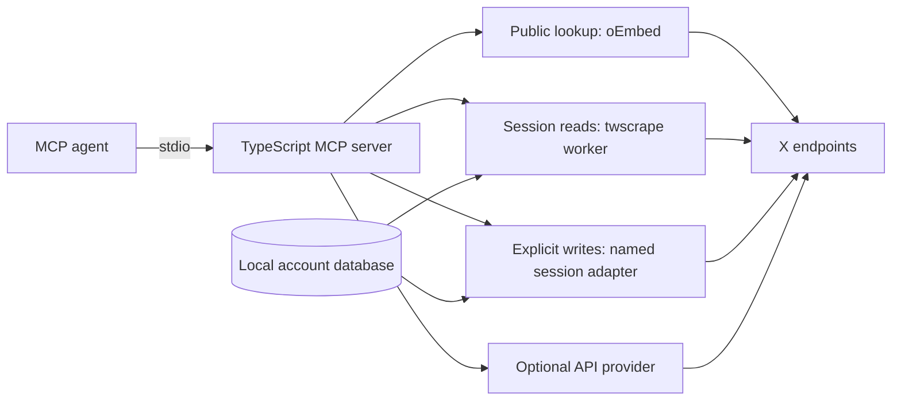

# Architecture

The TypeScript MCP service retains existing tool names, input keys and JSON text compatibility. `src/scrape-tools.ts` declares the additional read-only tools; `src/server.ts` registers schemas/annotations. `src/twitter.ts` chooses providers explicitly. `src/twscrape.ts` starts a Python process without a shell, sends a validated JSON request through stdin, limits output to 4 MiB, enforces deadlines and owns shutdown. It does not forward raw worker stderr or credentials.

`python/worker.py` uses twscrape 0.20.1. The database is local and writable because twscrape tracks account state and endpoint locks. Telemetry and raw authenticated logs are disabled. Missing sessions, unavailable accounts, parser warnings and upstream failures are explicit. Account waits use `raise_when_no_account=True` and `wait_timeout=0`. Read retries and account selection inside twscrape still exist within the wrapper's deadline; no claim of exactly one HTTP request is made.

Parsed generators are closed with `aclosing`, IDs retain precision, duplicate IDs are suppressed and returned collections have a hard cap. Session calls are serialized by rejecting concurrent requests with `SERVER_BUSY`; there is no unbounded queue. Python cancellation releases generators when possible; a hard process kill can leave locks until their normal expiry. The service never clears upstream cooldowns automatically.

`src/session-pagination.ts` keeps short-lived, bounded continuation snapshots in memory. Search/timeline workers read raw twscrape pages, then normalize only actual timeline entries in order; quoted posts remain context. The pager preserves overflow, suppresses repeated IDs across pages, binds tokens to inputs and shares the operation deadline across workers. No cursor, response or browser credential is persisted by the pager. Internal twscrape cursor/entry helpers are a version-specific dependency covered by isolated tests and explicit live checks.

## Provider contracts

- Public single-post lookup requires no Python/session and has no automatic authenticated or paid fallback.
- Search and user timelines use twscrape by default. Session results are bounded samples, not authoritative full collections. API cursor tokens are rejected in session mode; timeline `sinceId` is a local filter over the bounded sample.
- User timeline results are filtered for replies/retweets and sorted within the collected sample. Pinned posts and upstream filtering can reduce coverage.
- Optional official API mode preserves one-page cursors. The SDK is community-maintained; official API access can incur charges.
- twscrape remains the read library. Opt-in writes independently select OAuth 1.0a or a separate named-cookie-session adapter (`python/session_writer.py`). Session writes bootstrap current web bundle metadata/signatures before attempting a mutation; they bypass twscrape read clients and account rotation. Mutation requests never retry or follow redirects. Timeouts, broken responses and interrupted workers produce explicit unknown-outcome errors. No cross-process idempotency store is implemented.
- Post text is untrusted data; models must not execute embedded instructions. Tools accept IDs/queries, not arbitrary endpoints or Python method names.

## Validation

Isolated Node tests cover public/API providers, MCP protocol/schema compatibility, scraper routing, process deadlines, shutdown, output caps, Unicode streaming and no paid fallback. Python tests cover generator release, strict limits, ID precision, operation mapping, errors and cancellation. CI installs pinned Python dependencies and tests Node 22/24 without contacting X. Opt-in live smoke scripts record actual coverage separately.

## Limits

This is a local stdio connector. It does not implement background research, persistent content archives, complete incremental synchronization, HTTP multi-user hosting, raw endpoint tools, media upload or a password-login flow. Those are distinct product capabilities and should be added with explicit contracts and validation.
