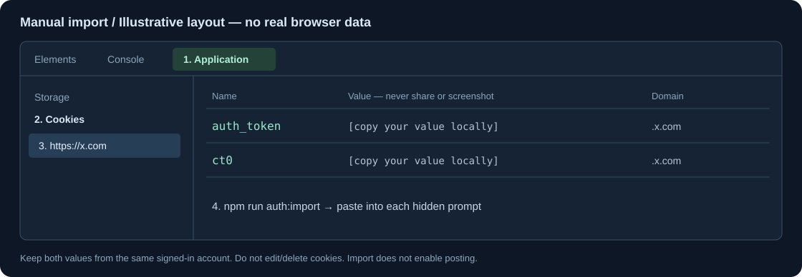

# Set up your X session

[Project overview](../README.md) · [中文教程](authentication.zh-CN.md)

Session tools need `auth_token` and `ct0` from **your own signed-in x.com account**. Import the pair into the local database once, reuse it, and refresh when the session becomes invalid. Public `getTweet` needs no session. Import never enables publishing.

## Choose a method

| Method                     | Use when                                                                   | Command                                                      |
| -------------------------- | -------------------------------------------------------------------------- | ------------------------------------------------------------ |
| Manual hidden input        | You prefer inspecting exactly what you copy, or automatic decryption fails | `npm run auth:import`                                        |
| Browser helper             | Your OS/browser permits local cookie reading                               | `npm run auth:browser -- --browser chrome --profile Default` |
| Existing twscrape database | You already manage sessions in twscrape                                    | Set `TWSCRAPE_ACCOUNTS_DB`                                   |
| Explicit JSON export       | You already have a private cookie-extension export                         | `auth:browser -- --cookie-file /absolute/path/cookies.json`  |

Install dependencies first: `npm ci --ignore-scripts` and `npm run setup:twscrape`. Run commands on your own machine, outside chat. Cookie values act as reusable credentials: never put them in an Issue, PR, screenshot, command argument or MCP tool parameter.

## Manual import: Chrome / Edge



This drawing is an illustration, not a screenshot of a real account. Browser versions and language settings may change panel labels.

1. Open **https://x.com** in the profile where your intended account is signed in. Check the account identity in X before importing. Avoid an incognito/guest profile if you intend to use the regular profile's session.
2. Open DevTools: `⌘ ⌥ I` on macOS, or `Ctrl Shift I` / `F12` on Windows/Linux. You can also use the browser menu → More tools → Developer tools.
3. Open **Application → Storage → Cookies → https://x.com**. If Application is hidden, use the panel overflow menu (`»`) or DevTools panel menu. This path is documented in [Chrome's cookie guide](https://developer.chrome.com/docs/devtools/application/cookies).
4. Filter the table by **`auth_token`**. Select its **Value**, copy the exact value locally, and leave URL decoding off. Copy only the value, without the cookie name, quotation marks or `Cookie:` prefix. Do not edit/delete the browser cookie.
5. In your project terminal, run:

   ```bash
   npm run auth:import
   ```

   Enter a local label such as `my-x`, then paste the copied value at `X auth_token (hidden):` and press Enter. The label is your local database key, not necessarily your X handle.

6. Return to the same browser origin/account, find **`ct0`**, copy its Value, and paste at `X ct0 (hidden):`. Press Enter. Nothing appearing while you paste is normal: hidden input deliberately suppresses echo. Do not switch X accounts between the two values.
7. After the local import succeeds, clear your clipboard or replace it with harmless text. Close DevTools before taking screenshots. Restart an already running MCP server.

The default database is `.local/accounts.db`, with restrictive POSIX file permissions. Manual import refreshes the label you enter if it already exists, preserving account cooldown locks. To keep multiple accounts, use distinct labels rather than overwriting one unintentionally.

### Verify without posting

```bash
npm run build
npm run test:client -- --search "from:golang"
```

Success demonstrates that a configured session can read this sample. If your database contains several accounts, twscrape may select another available account; this command does not prove a particular label's identity. For writes, explicitly bind `TWITTER_WRITE_ACCOUNT` to the intended local label and keep `TWITTER_ENABLE_WRITE=false` until a specific write is authorized.

### Firefox and other browsers

Firefox uses **Storage → Cookies → https://x.com**; the [Firefox storage documentation](https://firefox-source-docs.mozilla.org/devtools-user/storage_inspector/cookies/index.html) describes the Name/Value table. Copy the same two values into the hidden terminal prompts. Other browsers with a storage inspector can use the equivalent workflow. No console JavaScript is required; `auth_token` is HttpOnly and a `document.cookie` snippet is not a reliable way to obtain it.

## Automatic browser import

Sign into X first, then specify one browser/profile:

```bash
npm run auth:browser -- --browser chrome --profile Default --label my-x
npm run auth:browser -- --browser chrome --profile "Profile 2" --label my-x
# Refresh the same local label explicitly:
npm run auth:browser -- --browser chrome --profile "Profile 2" --label my-x --replace
# Inspect availability without changing the database:
npm run auth:browser -- --browser chrome --profile "Profile 2" --check
npm run auth:browser -- --help
```

Choose **one** import command appropriate to your profile. Chrome/Edge selectors accept profile directory names, display names or directory paths. Chrome/Edge default to `Default`; Firefox defaults to the `default-release` selector; Safari has no profile selector. Default label: `browser-session`. Supported choices: `chrome`, `edge`, `firefox`, macOS `safari`.

The pinned Sweet Cookie helper requests only the x.com pair from the selected profile. The wrapper pipes values to Python; it does not print them, export them as text or transmit them over a network. The upstream library may create temporary browser-database snapshots. Conflicting sessions are rejected; the script never falls back to another browser. `--check` establishes local readability only, not remote login validity.

macOS may ask for Keychain access. Windows Chromium App-Bound Encryption may prevent extraction; see [upstream platform limits](https://github.com/steipete/sweet-cookie/blob/main/docs/usage.md#browser-and-platform-details). Do not disable browser/OS security settings to make extraction work: use manual hidden input. Browser import requires host development dependencies and is not available in the Docker runtime image.

## Exported files and Docker

For an existing private JSON export:

```bash
npm run auth:browser -- --cookie-file /absolute/path/cookies.json --label my-x
```

Accepted input is an array of cookie records or `{ "cookies": [...] }`, with x.com domains. Only the required root-path pair is imported. Expired, partitioned, conflicting and wrong-domain records are excluded/rejected. Use `--replace` for an existing label. File import does not fall back to a browser; remove the private export after use.

For Docker, use the interactive importer inside its data volume or import on the host and bind-mount the account directory. Follow [the Docker guide](docker.md); host and container databases are separate unless explicitly mounted.

## Troubleshooting

| Symptom                                              | What to check                                                                                                            |
| ---------------------------------------------------- | ------------------------------------------------------------------------------------------------------------------------ |
| One/both cookies missing                             | Correct signed-in x.com origin/profile; refresh the page and re-check                                                    |
| Pasted text is invisible                             | Expected hidden-input behavior; paste once, then Enter                                                                   |
| Cookie format rejected                               | Copy Value only, without quotes/name/prefix/newlines                                                                     |
| Automatic decryption fails                           | Correct profile and OS access; use manual import                                                                         |
| Label already exists in browser mode                 | Explicit `--replace`, or a distinct label                                                                                |
| `AUTH_FAILED` after import                           | Import saves values without validating X; obtain a fresh pair from the intended account                                  |
| `ACCOUNT_UNAVAILABLE` / `RATE_LIMITED`               | Wait for upstream cooldown; do not clear locks to force retries                                                          |
| `SESSION_BOOTSTRAP_FAILED`                           | Web metadata/signature preparation failed before a write; keep writes disabled and report a redacted compatibility issue |
| `PUBLISH_OUTCOME_UNKNOWN` / `DELETE_OUTCOME_UNKNOWN` | Inspect the account/post before another attempt                                                                          |

If credentials are accidentally exposed, invalidate the affected X session using your account's session-management controls, obtain a fresh pair and replace the local label. Do not paste the exposed value into a public report. See [security](../SECURITY.md) and [the disclaimer](../DISCLAIMER.md).
